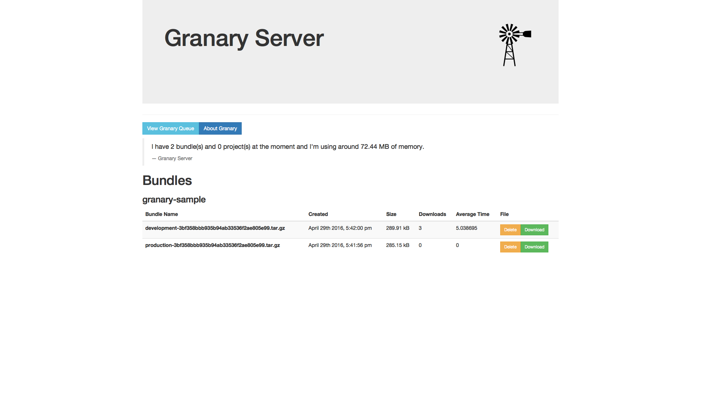

# granary-server [](https://travis-ci.org/gabrielcsapo/granary-server) [](https://david-dm.org/gabrielcsapo/granary-server) [](https://david-dm.org/gabrielcsapo/granary-server#info=devDependencies)

> based on https://github.com/node-freight/freight-server
> forked and renamed due to lack of culpability in helping add functionality to freight
> hopefully will be able to merge upstream once features and bugs are fixed.

# Quick Server Setup

```
git clone https://github.com/gabrielcsapo/granary-server.git
vagrant up;
vagrant ssh;
npm install;
npm start
```

### Usage

> starting up the server with defaults

```
npm start
```

> starting up the server with custom config

```
GRANARY_CONFIG={location} npm start
```

### Configure

#### Password

Freight Server automatically configures a password for you. You can change it by modifying the [dev.json](config/dev.json-dist) file.

A password setting of `""` (empty string) indicates that the Freight Server will not require a password for any actions.

Server will start on port `8872`. You should be able to navigate to the dashboard:



#### Other Configuration

See [config/config.js](config/config.js#L12) for available
configuration options and environment variables. The Freight Server uses [node-convict](https://github.com/mozilla/node-convict) to manage configuration.

# Contributions

> all contributions are welcome and wanted

## Ways to contribute

- create an issue
    - if the issue is UI related, please provide a screenshot
    - if the issue is code related, please provide code sample that causes this issue (a curl command, etc)
- close an issue or code cleanup
    - branch names should be named `fix-#{issue-number}` if they are fixing an issue
    - branches that are aimed at code cleanup should be labeled `cleanup-{area-of-cleanup}`
    - please run `npm test` and `grunt screenshot` before issuing a PR 
